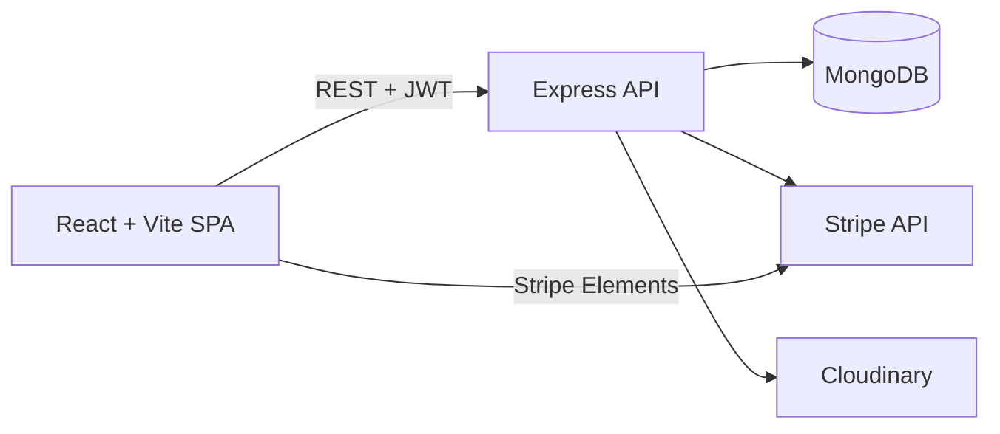

# 🏨 Holidays . Hotel Booking & Management Platform

A full-stack hotel booking platform where travelers can search and book stays, and hotel owners can list properties and track revenue. Built with **React, TypeScript, Express, MongoDB, and Stripe**, with an end-to-end **Playwright** test suite.

<p align="center">
[](https://hotel-management-app-rouge.vercel.app)


</p>

**👉 [Try the live demo](https://hotel-management-app-rouge.vercel.app)**

<!-- TODO: add screenshots to docs/screenshots/ and uncomment
## Screenshots

| Search | Hotel details | Owner dashboard |
| --- | --- | --- |
|  |  |  |
-->

## Table of Contents

- [Features](#features)
- [Tech Stack](#tech-stack)
- [Architecture](#architecture)
- [Getting Started](#getting-started)
- [Demo Accounts](#demo-accounts)
- [Routes](#routes)
- [API Reference](#api-reference)
- [Testing](#testing)
- [Deployment](#deployment)
- [Troubleshooting](#troubleshooting)
- [Security Notes](#security-notes)
- [Contributing](#contributing)
- [License](#license)

## Features

**For travelers**
- Search hotels by destination and filter by facilities, price, and rating
- View hotel details and book with a secure Stripe checkout
- Track all your reservations under **My Bookings**

**For hotel owners**
- Add and edit hotel listings with image uploads (Cloudinary)
- View bookings for each of your hotels
- Dashboard with revenue, bookings by month, and per-hotel stats

**Platform**
- JWT-based authentication with token validation middleware
- Responsive, mobile-friendly UI (Tailwind CSS)
- Playwright E2E tests covering auth, search, and hotel management

## Tech Stack

| Layer | Technologies |
| --- | --- |
| Frontend | React, TypeScript, Vite, React Router, React Query, React Hook Form, Tailwind CSS |
| Backend | Node.js, Express, TypeScript, Mongoose |
| Database | MongoDB (local or Atlas) |
| Payments | Stripe (PaymentIntents + `@stripe/react-stripe-js`) |
| Media | Cloudinary |
| Auth | JWT, bcrypt |
| Testing | Playwright |

## Architecture



```
hotel_management_app/
├── Backend/      # Express API (TypeScript)
├── Frontend/     # React + Vite app (TypeScript)
├── e2e/          # Playwright end-to-end tests
└── Data-test/    # Test data files
```

## Getting Started

### Prerequisites

- **Node.js** 18+ and npm
- **MongoDB** — local instance or a [MongoDB Atlas](https://www.mongodb.com/atlas) connection string
- **Stripe account** — test keys are fine
- **Cloudinary account** — needed for hotel image uploads

### 1. Clone and install

```bash
git clone https://github.com/Zineddine-Rebbouh/hotel_management_app.git
cd hotel_management_app

(cd Backend && npm install)
(cd Frontend && npm install)
(cd e2e && npm install)
```

### 2. Configure environment variables

**Backend** — copy the template and fill it in:

```bash
cd Backend
cp .env.example .env
```

| Variable | Description | Example |
| --- | --- | --- |
| `MONGO_DB_CONNECTION` | MongoDB connection string | `mongodb://localhost:27017/hotel_management_app` |
| `PORT` | API port | `8000` |
| `NODE_ENV` | Environment | `development` |
| `JWT_SECRET` | Secret used to sign tokens | *(long random string — see below)* |
| `STRIPE_SECRET_KEY` | Stripe secret key | `sk_test_...` |
| `STRIPE_PUBLIC_KEY` | Stripe publishable key | `pk_test_...` |
| `CLOUDINARY_CLOUD_NAME` | Cloudinary cloud name | |
| `CLOUDINARY_API_KEY` | Cloudinary API key | |
| `CLOUDINARY_API_SECRET` | Cloudinary API secret | |
| `CORS_ORIGIN` | Allowed frontend origin | `http://localhost:5173` |

Generate a strong `JWT_SECRET` with:

```bash
node -e "console.log(require('crypto').randomBytes(32).toString('hex'))"
```

**Frontend** — create `Frontend/.env.local`:

```env
VITE_API_BASE_URL=http://localhost:8000
VITE_STRIPE_PUBLIC_KEY=pk_test_your_key
```

### 3. Start MongoDB

Skip this step if you're using Atlas.

```bash
mongod
```

### 4. Seed sample data

```bash
cd Backend
npm run seed
```

This creates demo users, 5 sample hotels across different cities, and 1 sample booking.

### 5. Run the app

Open two terminals:

```bash
# Terminal 1 — API on http://localhost:8000
cd Backend
npm run dev
```

```bash
# Terminal 2 — App on http://localhost:5173
cd Frontend
npm run dev
```

## Demo Accounts

| Role | Email | Password |
| --- | --- | --- |
| Traveler | `guest@example.com` | `password123` |
| Hotel owner | `host1@example.com` | `password123` |

You can also create your own account from `/sign-up`.

**Test payments:** Stripe runs in test mode. Use card `4242 4242 4242 4242` with any future expiry date and any CVC.

## Routes

**Public**

| Route | Description |
| --- | --- |
| `/` | Home page with latest destinations |
| `/search` | Search and filter hotels |
| `/detail/:hotelId` | Hotel details |
| `/sign-in` · `/sign-up` | Login and registration |

**Authenticated**

| Route | Description |
| --- | --- |
| `/hotel/:hotelId/booking` | Booking and payment |
| `/my-bookings` | Your bookings across all hotels |
| `/my-hotels` | Manage your hotels *(owners)* |
| `/add-hotel` | Add a new hotel *(owners)* |
| `/edit-hotel/:hotelId` | Edit a hotel *(owners)* |
| `/dashboard` | Revenue and booking analytics *(owners)* |

## API Reference

**Authentication**

| Method | Endpoint | Description |
| --- | --- | --- |
| `POST` | `/api/auth/login` | Log in |
| `POST` | `/api/users/register` | Register |
| `GET` | `/api/auth/validate-token` | Validate the current JWT |
| `POST` | `/api/auth/logout` | Log out |

**Hotels & bookings**

| Method | Endpoint | Description |
| --- | --- | --- |
| `GET` | `/api/hotels/search?destination=...` | Search hotels |
| `GET` | `/api/hotels/:id` | Hotel details |
| `POST` | `/api/hotels/:hotelId/booking/payment-intent` | Create a Stripe payment intent |
| `POST` | `/api/hotels/:hotelId/bookings` | Create a booking |
| `GET` | `/api/hotels/user/bookings` | Current user's bookings |

**Owner endpoints**

| Method | Endpoint | Description |
| --- | --- | --- |
| `GET` | `/api/my-hotels` | List your hotels |
| `POST` | `/api/my-hotels` | Add a hotel |
| `GET` | `/api/my-hotels/:hotelId` | Get one of your hotels |
| `PUT` | `/api/my-hotels/:hotelId` | Update a hotel |
| `GET` | `/api/my-hotels/dashboard/stats` | Dashboard statistics |
| `GET` | `/api/hotels/:hotelId/bookings` | Bookings for a hotel |

## Testing

End-to-end tests use [Playwright](https://playwright.dev). The backend and frontend must be running locally first.

```bash
cd e2e
npm test
```

| Spec | Covers |
| --- | --- |
| `auth.spec.ts` | Login and registration |
| `hotel.spec.ts` | Hotel search and filters |
| `menage.hotel.spec.ts` | Hotel management |

## Deployment

- **Frontend:** deployed on Vercel — [live demo](https://hotel-management-app-rouge.vercel.app). Set `VITE_API_BASE_URL` and `VITE_STRIPE_PUBLIC_KEY` in the project's environment settings.
- **Backend:** a `railway.json` is included for deploying the API on Railway. Set all backend variables from the table above, and point `CORS_ORIGIN` at your deployed frontend URL.

Manual production build:

```bash
# Backend
cd Backend
npm run build
npm start

# Frontend (outputs to Frontend/dist/)
cd Frontend
npm run build
```

## Troubleshooting

**`MongoDB connection error: connect ECONNREFUSED`**
MongoDB isn't running. Start it with `mongod`, or set `MONGO_DB_CONNECTION` to your Atlas connection string.

**`Error creating payment intent`**
Check that `STRIPE_SECRET_KEY` is a valid test key (starts with `sk_test_`).

**`Access to XMLHttpRequest has been blocked by CORS policy`**
Set `CORS_ORIGIN` in the backend `.env` to match your frontend URL (default `http://localhost:5173`).

**Image uploads fail**
Verify all three `CLOUDINARY_*` variables are set.

## Security Notes

- Passwords are hashed with bcrypt
- JWT authentication with validation middleware on protected routes
- Secrets live in environment variables and are never committed
- Card details are collected by Stripe Elements and sent directly to Stripe, not stored on this server
- CORS is restricted to the configured `CORS_ORIGIN`

## Contributing

1. Fork the repository
2. Create a feature branch: `git checkout -b feature/amazing-feature`
3. Commit your changes: `git commit -m "Add amazing feature"`
4. Push the branch: `git push origin feature/amazing-feature`
5. Open a pull request

## License

Distributed under the ISC License.

## Author

**Zineddine Rebbouh** — [GitHub](https://github.com/Zineddine-Rebbouh) · [Portfolio](https://zinedine-rebbouh-portfolio-website.vercel.app)
